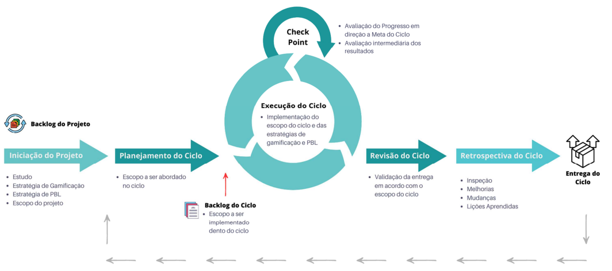

# Metodologia de desenvolvimento do Projeto e Fases

O projeto irá envolver um docente e quatro discentes durante todo o seu período de execução e será dividido nas seguintes fases:
* Iniciação do Projeto:
Nesta fase os alunos deverão estudar as práticas, atualmente, utilizadas na disciplina de Requisitos, bem como os princípios e conceitos de gamificação e PBL. Além disso, deverão ser definidas as estratégias de gamificação e BPL, envolvendo a definição ao framework a ser utilizado, formas de coleta, metodologia de identificação do perfil dos estudantes, técnicas e práticas, bem como qual(is) ferramenta(s) de TIC irá(ão) suportar a gamificação. Assim como, a maneira na qual ocorrerá a combinação da gamificação com a PBL.

Ao final desta fase, o backlog de itens a serem implementados no projeto deverá estar construído, assim como definidas as estratégias de gamificação e PBL. Ressalta-se que a Iniciação está prevista para durar quatro semanas.

* Planejamento do Ciclo:
Nesta fase, diante do backlog do projeto, deverão ser avaliados e priorizados os itens que deverão fazer parte de um ciclo de desenvolvimento, os quais deverão ser registrados no backlog do ciclo. Cada ciclo deverá ser executado em duas semanas.

* Execução do Ciclo:
Aqui, todo o escopo definido no backlog do ciclo deverá ser implementado em alinhamento com as estratégias de gamificação e PBL estabelecidas na Iniciação, podendo ser um software funcional disponível para utilização na disciplina (solução web ou mobile), uma customização ou utilização de algum recurso do Teams, ou do Aprender, bem como uma atividade ou dinâmica não suportada por TIC. Dentro da execução dos ciclos, haverá ainda um checkpoint entre docente e discentes envolvidos no projeto visando avaliar o progresso do ciclo e seus resultados parciais.

* Revisão do Ciclo:
Após a execução deverá ocorrer a validação das entregas do ciclo tendo como base o backlog do ciclo. Neste momento, deverão ser coletados feedbacks sobre as entregas, atestando, ao final, se serão ou não aceitas, e colocadas em uso na disciplina, ou se irão precisar de ajustes / correções em um novo ciclo.

* Retrospectiva do Ciclo:
Aqui, a equipe deverá avaliar suas práticas, interações e processo utilizados no ciclo. Possibilidades de melhoria, mudanças e lições aprendidas devem ser coletadas e acompanhadas nos ciclos subsequentes. 

A seguir, a Figura 1, representa como irá ocorrer a interação entre cada uma das fases, representado um ciclo completo. Ao final de cada ciclo deve-se rever e atualizar o backlog do projeto, assim como as estratégias de gamificação e PBL, se necessário. A partir disso, realiza-se novamente o planejamento de um ciclo, e assim, por diante, até o projeto seja encerrado. 

Figura 1. Estratégia de Execução do Projeto, em ciclos (baseado no framework SCRUM).

É importante destacar que, paralelo ao desenvolvimento de um novo ciclo, caso já haja implementações disponíveis para uso na disciplina, será realizado o acompanhamento e coleta de indicadores de aprendizagem e, dos resultados das implementações. Tais atividades são brevemente descritas, a seguir:

* Acompanhamento e Coleta de Indicadores de Aprendizagem Esta atividade irá ocorrer em alinhamento aos indicadores de aprendizagem registrados na seção 5, deste documento.

* Acompanhamento e Coleta de Resultados das Implementações Esta atividade deverá coletar feedback de uso de soluções de TIC, ou sobre as atividades gamificadas e de PBL, do ponto de vista dos discentes da disciplina de REQ.

Essas informações podem gerar novas demandas e implementações em outros ciclos, assim como a necessidade de ajustes das estratégias de gamificação e PBL propostas na Iniciação. Um ponto a ser destacado em relação a metodologia do projeto, diz respeito ao semestre de 2023.2, no qual o professor George Marsicano irá ministrar duas turmas de REQ. Neste sentido, a aplicação das estratégias de gamificação e PBL a serem abordadas neste projeto poderão ser aplicadas a apenas uma das turmas, visando uma comparação ao final (entre os indicadores de aprendizagem, por exemplo), com a turma que não teve a aplicação.

Por fim, todos os registros, informações, relatórios, resultados do projeto etc., estarão
disponíveis e acessíveis, publicamente, em um repositório (a ser criado) da disciplina de REQ no
GitHub (https://github.com/mdsreq-fga-unb). 

# Produtos a desenvolver

### Iniciação do Projeto

| Produto      | Descrição    |
|:-------------|:-------------|
| Visão de Produto e Projeto | Artefato que deverá conter a organização, objetivos, papeis e responsabilidades, escopo, matriz de comunicação, gerenciamento de risco, critérios de replanejamento e processo a ser utilizado no projeto.  |
|Backlog do Projeto| Itens de trabalho a serem implementados durante a execução do projeto. |
| Relatório de Estratégias de gamificação e PBL | Artefato que registra as estratégias a serem utilizadas para gamificação e PBL, contendo: framework a ser utilizado, formas de coleta, metodologia de identificação do perfil dos estudantes, técnicas e práticas, bem como qual(is) ferramenta(s) de TIC irá(ão) suportar a gamificação. |

### Planejamento do Ciclo
| Produto      | Descrição    |
|:-------------|:-------------|
| Plano do Ciclo | Artefato que registra a meta do ciclo, período de realização, papeis e responsabilidades, e resultados esperados. | 
| Backlog do Ciclo | Artefato que registra o escopo a ser tratado no ciclo. | 

### Execução do Ciclo
| Produto      | Descrição    |
|:-------------|:-------------|
| Solução de TIC | Produto de software funcional disponível para utilização na disciplina (solução web ou mobile), uma customização ou utilização de algum recurso do Teams, ou do Aprender.  | 

### Revisão do Ciclo
| Produto      | Descrição    |
|:-------------|:-------------|
| Relatório de Revisão | Artefato de registro de feedbacks sobre as entregas, atestando, ao final, se serão ou não aceitas, e colocadas em uso na disciplina, ou se irão precisar de ajustes / correções em um novo ciclo. | 

### Retrospectiva do Ciclo
| Produto      | Descrição    |
|:-------------|:-------------|
| Relatório de Retrospectiva | Artefato de registro de avaliação das práticas, interações e processo utilizados no ciclo, assim como possibilidades de melhoria, mudanças e lições aprendidas. | 

 

| Atividade    | Produto      | Descrição    |
|:-------------|:-------------|:-------------|
| Acompanhamento e Coleta de Indicadores de Aprendizagem | Relatório de Indicadores | Artefato de registro dos indicadores e seus resultados coletados. |
|Acompanhamento e Coleta de Resultados das Implementações | Relatório de Resultados | Artefato de registro de avaliação dos resultados obtidos, a partir da implementação da estratégia (total ou parcial). |

 

# Cronograma de Execução 
A seguir, é apresentado o cronograma de execução deste projeto. Cabe ressaltar que, conforme estabelecido na metodologia, será utilizada uma abordagem iterativa e incremental, assim sendo cada uma das fases será realizada mais de uma vez, em ciclos e meses diferentes. 

| Fase/Atividade | Jul/23 | Ago/23 | Set/23 | Out/23 | Nov/23 | Dez/23 |
|:---------------|:------:|:------:|:------:|:------:|:------:|:------:|
|Iniciação do Projeto|x   |x       |x       |x       |        |        |
|Planejamento do Ciclo |  |x       |x       |x       |        |        |
|Execução do Ciclo |      |x       |x       |x       |x       |        |
|Revisão do Ciclo |       |        |x       |x       |x       |x       |
|Retrospectiva do Ciclo|  |        |x       |x       |x       |x       |
|Acompanhamento e Coleta de Indicadores de Aprendizagem |||x|x|x|x     |
|Acompanhamento e Coleta de Resultados das Implementações |||x|x|x|x   |

  
