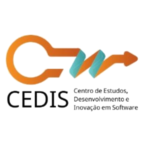

  

# Super-R

> Gamificação aplicada no ensino

- Projeto com foco na melhoria do processo de ensino-aprendizagem da disciplina de Requisitos de Software (REQ) da Faculdade do Gama (FGA), UnB.

[GitHub](https://github.com/marsicanogeorge/RequirementsGamificationPBL)
[Documentação](Inicio.md)
